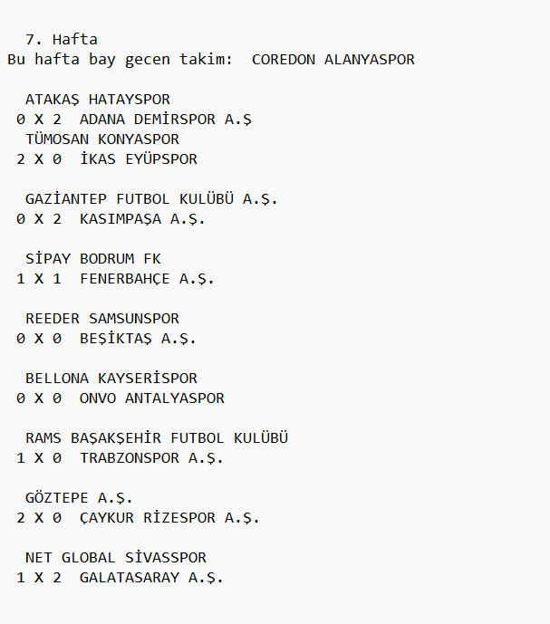
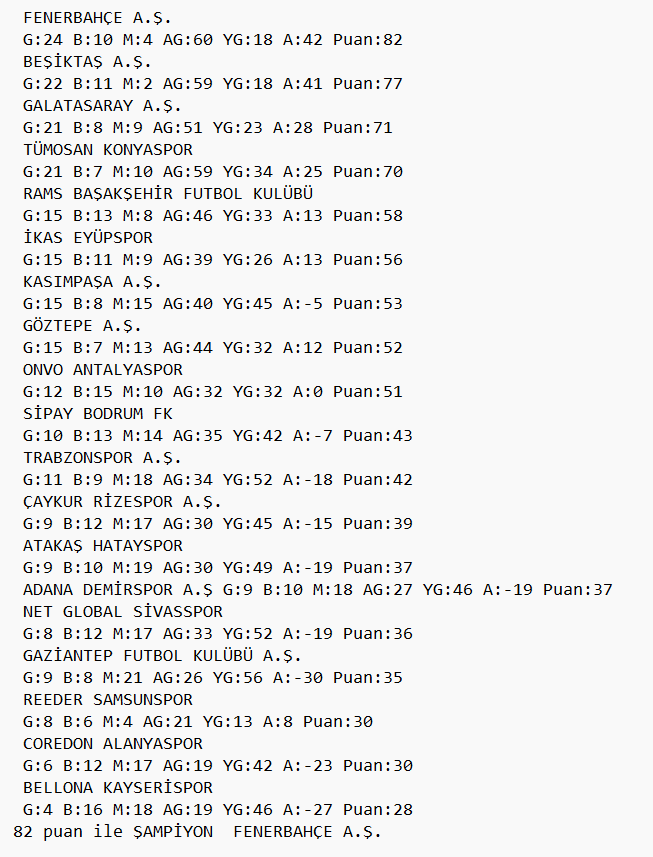

# Available Languages: 
[English](ReadMe.eng.md) | [Turkish](ReadMe.md)

# <center>Figure Creation Assignment</center>

It is a C script that pairs teams taken from a given `teams.txt` file, plays matches between them every week and generates a score table based on the results. The match scores are based on the power differential of the teams.


## Contents
- [Project Requirements](#project-requirements)  
- [Running](#running)  
- [Manual Compilation](#manual-compilation)  
- [Code Compilation](#code-compilation)  
- [File Format](#file-format)  
- [Things to Watch Out For](#things-to-watch-out-for)  
- [What's New](#whats-new-10052025)


## Project Requirements

### Code compilation tools

```
gcc
```

## Supported Operating Systems

- Windows
- Linux

## Running

### Windows

```
./fikstur.exe
```

### Linux

```
./fikstur.o
```

## Manual Compilation

#### Download Requirements

#### Fedora

```
sudo dnf install gcc
```

#### Ubuntu

```
sudo apt-get install gcc
```

#### Windows

```
Mingw64-gcc
```

### Code Compilation

#### Windows
```
gcc -o fikstur.exe fikstur.c
```

#### Windows
```
gcc -o fikstur.o fikstur.c
```

## File Format

#### Teams File

Sample file format

```
(Team Name)
(Team Name)
(Team Name)
(Team Name)
```

### Fixture Output File



#### Power File
```
(count)
(count)
(count)
```

### Score File



## Things to Watch Out For

- The tools file must be in sample file format or it may give an error.
- The power range difference should be at most 50 and the power number should be a multiple of 10 (90 80 70 60 50 40 was used.)
  
## What's New 10.05.2025
- Functions are more organized and ordered.
- Hidden `.gitingore` and `.txt` files.
- Added `makefile` file.