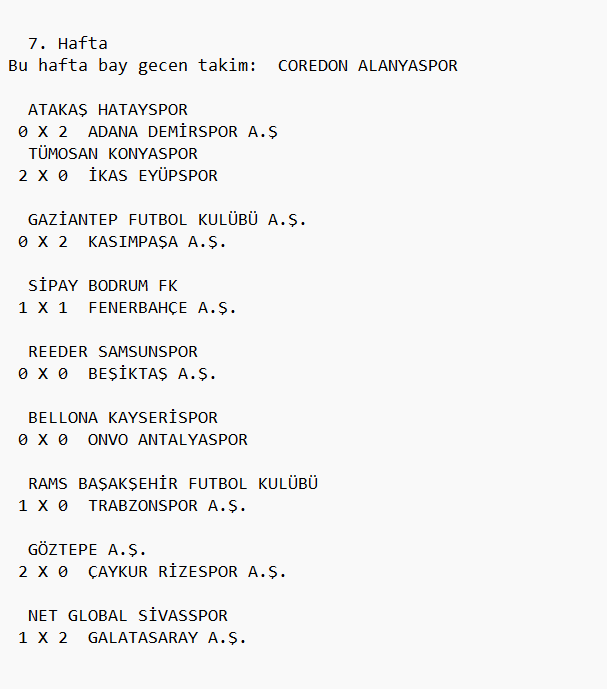
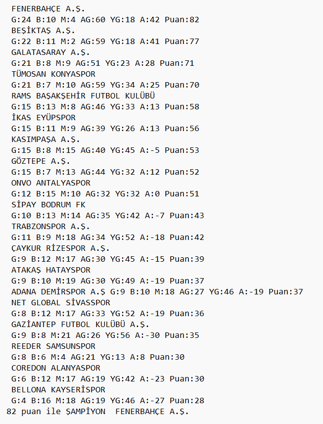

# Available Languages: 
[English](ReadMe.eng.md) | [Türkçe](ReadMe.md)

# <center>Fikstür Oluşturma Ödevi</center>

Verilen bir `takimlar.txt` dosyasından alınan takımları her hafta eşleştirerek aralarında maçlar oynatan ve sonuçlara göre bir puan tablosu oluşturan bir C kodudur. Maç skorları, takımların güç farklarına bağlı olarak belirlenmektedir.


## İçindekiler
- [Proje Gereksinimleri](#proje-gereksinimleri)  
- [El İle Koşturma](#el-ile-koşturma)  
- [El ile Derleme](#el-ile-derleme)  
- [Kodu Derleme](#kodu-derleme)  
- [Dosya Formatı](#dosya-formatı)  
- [Dikkat Edilmesi Gerekenler](#dikkat-edilmesi-gerekenler)  
- [Yenilikler](#yenilikler-10052025)


## Proje Gereksinimleri

### Kod derleme araçları

```
gcc
```

## Desteklenen İşletim Sistemleri

- Windows
- Linux

## El ile Koşturma

### Windows

```
./fikstur.exe
```

### Linux

```
./fikstur.o
```

## El ile Derleme

### Gereksinimleri İndirme

#### Fedora

```
sudo dnf install gcc
```

#### Ubuntu

```
sudo apt-get install gcc
```

#### Windows

```
Mingw64-gcc
```

### Kodu Derleme

#### Windows
```
gcc -o fikstur.exe fikstur.c
```

#### Windows
```
gcc -o fikstur.o fikstur.c
```

## Dosya Formatı

### Takımlar Dosyası

Örnek dosya formatı

```
(Takım Adı)
(Takım Adı)
(Takım Adı)
(Takım Adı)
```

### Fikstur Çıktı Dosyası



### Power Dosyası
```
(sayi)
(sayi)
(sayi)
```

### Puan Dosyası



## Dikkat Edilmesi Gerekenler

- Takımlar dosyasını örnek dosya formatında olması gerek yoksa hata verebilir.
- Güç aralığını farkını en fazla 50 olması ve güç sayısı 10 nun katları olmalı. (90 80 70 60 50 40 kullanılmıştır.)
  
## Yenilikler 10.05.2025
- Fonksiyonlar daha düzenli ve sıralı hale getirildi.
- `.gitignore` ile `.txt` dosyaları gizlendi.
- `makefile` dosyası eklendi.
